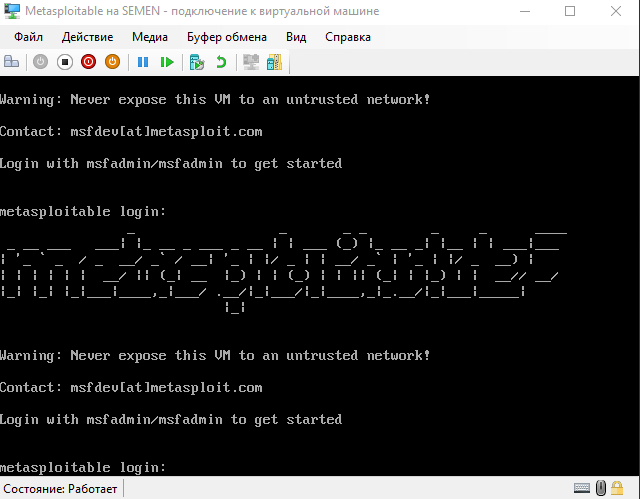
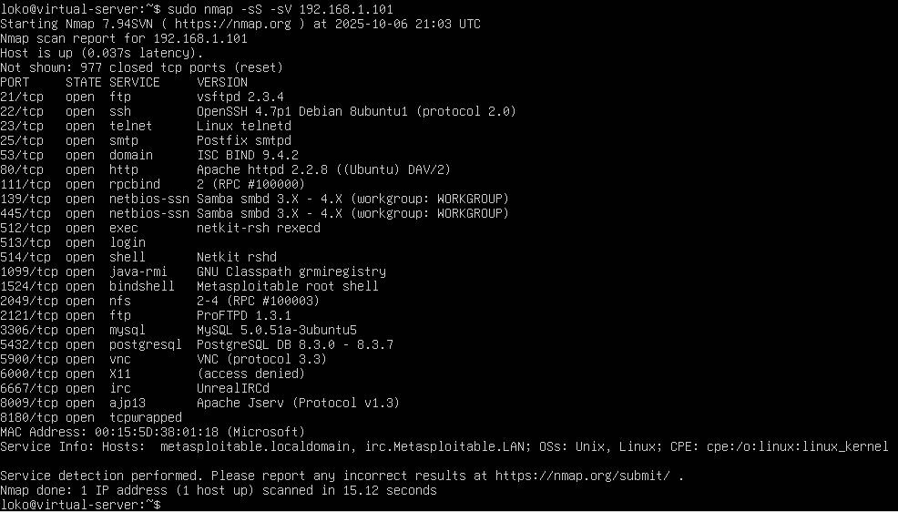
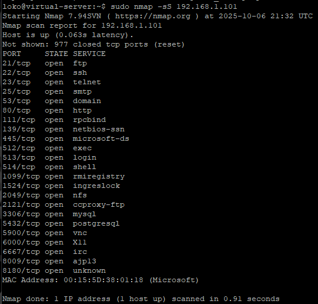
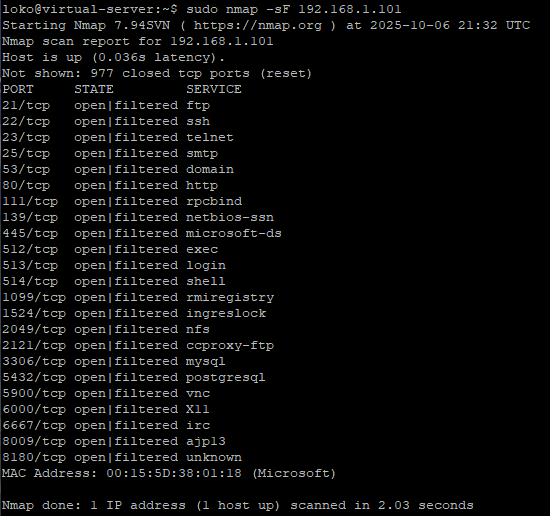
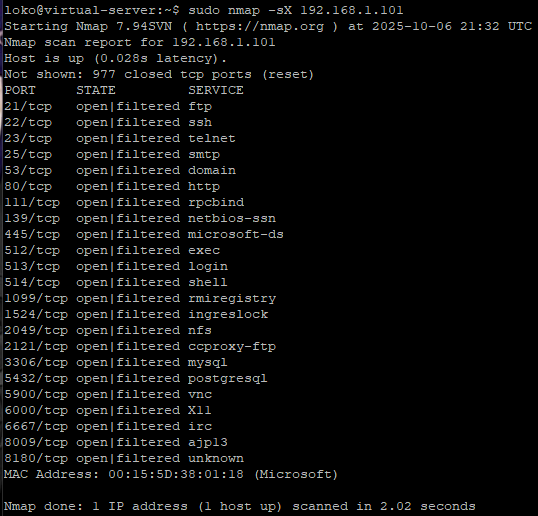
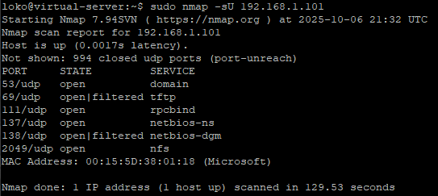

# [Домашнее задание](https://github.com/netology-code/sdb-homeworks/blob/main/13-01.md) к занятию "`Уязвимости и атаки на информационные системы`" - `Янин Семён Васильевич`


### Инструкция по выполнению домашнего задания

   1. Сделайте `fork` данного репозитория к себе в Github и переименуйте его по названию или номеру занятия, например, https://github.com/имя-вашего-репозитория/git-hw или  https://github.com/имя-вашего-репозитория/7-1-ansible-hw).
   2. Выполните клонирование данного репозитория к себе на ПК с помощью команды `git clone`.
   3. Выполните домашнее задание и заполните у себя локально этот файл README.md:
      - впишите вверху название занятия и вашу фамилию и имя
      - в каждом задании добавьте решение в требуемом виде (текст/код/скриншоты/ссылка)
      - для корректного добавления скриншотов воспользуйтесь [инструкцией "Как вставить скриншот в шаблон с решением](https://github.com/netology-code/sys-pattern-homework/blob/main/screen-instruction.md)
      - при оформлении используйте возможности языка разметки md (коротко об этом можно посмотреть в [инструкции  по MarkDown](https://github.com/netology-code/sys-pattern-homework/blob/main/md-instruction.md))
   4. После завершения работы над домашним заданием сделайте коммит (`git commit -m "comment"`) и отправьте его на Github (`git push origin`);
   5. Для проверки домашнего задания преподавателем в личном кабинете прикрепите и отправьте ссылку на решение в виде md-файла в вашем Github.
   6. Любые вопросы по выполнению заданий спрашивайте в чате учебной группы и/или в разделе “Вопросы по заданию” в личном кабинете.
   
Желаем успехов в выполнении домашнего задания!
   
### Дополнительные материалы, которые могут быть полезны для выполнения задания

1. [Руководство по оформлению Markdown файлов](https://gist.github.com/Jekins/2bf2d0638163f1294637#Code)

---

### Задание 1





1. Различные TCP-порты, где есть `ftp`, `ssh`, `mysql` и тд, достаточно большой список.
2. Первым будет `vsftpd` версии 2.3.4 [Backdoor Command Execution](https://www.exploit-db.com/exploits/49757); две DoS уязвимости [`1`](https://www.exploit-db.com/exploits/30020) [`2`](https://www.exploit-db.com/exploits/29724) для `mysql` версий 5.0.x; также может быть уязвим [`ProFTPd`](https://www.exploit-db.com/exploits/15449) 


---

### Задание 2

Скан: [`metasploit_scan.pcap`](https://github.com/S1mu0us/Vulnerabilities-and-attacks-on-information-systems/blob/d8a8034fb5d87841fec837cf2226330d3c36439d/metasploit_scan.pcap)

```
...
   25   0.129253 192.168.1.101 → 192.168.1.33 TCP 60 1025 → 51761 [RST, ACK] Seq=1 Ack=1 Win=0 Len=0
   26   0.130490 192.168.1.101 → 192.168.1.33 TCP 60 445 → 51761 [SYN, ACK] Seq=0 Ack=1 Win=5840 Len=0 MSS=1460
   27   0.130515 192.168.1.33 → 192.168.1.101 TCP 54 51761 → 445 [RST] Seq=1 Win=0 Len=0
   28   0.130527 192.168.1.101 → 192.168.1.33 TCP 60 443 → 51761 [RST, ACK] Seq=1 Ack=1 Win=0 Len=0
   29   0.130578 192.168.1.33 → 192.168.1.101 TCP 58 51761 → 554 [SYN] Seq=0 Win=1024 Len=0 MSS=1460
   30   0.130666 192.168.1.33 → 192.168.1.101 TCP 58 51761 → 139 [SYN] Seq=0 Win=1024 Len=0 MSS=1460
   31   0.130681 192.168.1.33 → 192.168.1.101 TCP 58 51761 → 993 [SYN] Seq=0 Win=1024 Len=0 MSS=1460
   32   0.130695 192.168.1.33 → 192.168.1.101 TCP 58 51761 → 256 [SYN] Seq=0 Win=1024 Len=0 MSS=1460
   33   0.130709 192.168.1.33 → 192.168.1.101 TCP 58 51761 → 1720 [SYN] Seq=0 Win=1024 Len=0 MSS=1460
   34   0.130723 192.168.1.33 → 192.168.1.101 TCP 58 51761 → 25 [SYN] Seq=0 Win=1024 Len=0 MSS=1460
   35   0.130736 192.168.1.33 → 192.168.1.101 TCP 58 51761 → 22 [SYN] Seq=0 Win=1024 Len=0 MSS=1460
...
```

`SYN` отправляет TCP пакет с флагом SYN, Если порт открыт, то целевой хост отвечает SYN/ACK, сканер шлёт RST. А если порт закрыт, то целевой хост отвечает RST.



`FIN` отправляет TCP пакет с флагом FIN, где при открытом порту нету ответа, а если есть, то RST. Он пытается обмануть старые фильтры.



`Xmas` кидает TCP пакет с флагами FIN, PSH, URG. С откртыми портами также не дает ответ, а с загрытыми RST. Это ещё одна техника обхода сигнатур фильтров.



`UDP` шлет специфичный запрос в протоколе. С открытым портом отвечает, указывая тип и код, с закрытыми не даёт ответа. Генерирует ICMP‑трафик.



---

